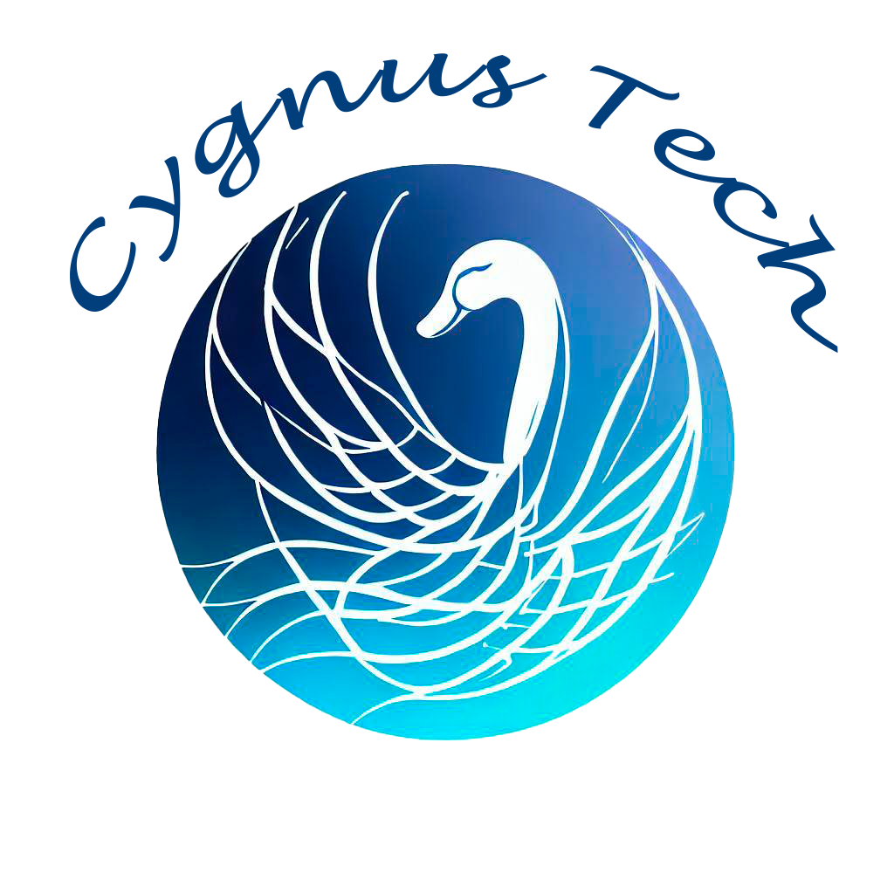

[![Contributors][contributors-shield]][contributors-url]
[![Forks][forks-shield]][forks-url]
[![Stargazers][stars-shield]][stars-url]
[![Issues][issues-shield]][issues-url]
[![MIT License][license-shield]][license-url]
[![LinkedIn][linkedin-shield]][linkedin-url]

  

  
  

<h1 align="center">Projeto Talk to Me</h3>

<!-- ABOUT THE PROJECT -->

## Sobre o Projeto

Projeto criado para aprendizagem da linguagem Typescript, seguindo aulas da Alexia (HeroCode)
Com o intuito de aprendizado não foram feitas modificações nas funcionalidades além do que foi apresentado nas aulas.
O intuito do projeto é criar um mecanismo de sala de reuniões usando a tecnologia WebRTC.
O WebRTC permite a comunicação direta entre navegadores (peer-to-peer) para transmissão de áudio e vídeo sem a necessidade de um servidor intermediário

<h4>Title</h4>
Description

  

 

(<a href="#top">back to top</a>)

# Tecnologias

### Languages

### Frameworks, Platforms and Libraries

### Databases

Não foram utilizadas comunicações com base de dados

### Designer

### Testing

Não foram aplicados testes nesse projeto.

<!-- CONTACT -->

## Contatos

Marcos Araujo - [@linkedIn](https://www.linkedin.com/in/marcosaraujosouza/) - marcos.araso@hotmail.com

Project Link: [Projeto_Base_TaketoMe](https://github.com/marcosaraujo-dev/TalkToMe)

(<a href="#top">back to top</a>)

<!-- ACKNOWLEDGMENTS -->

## Agradecimentos

- [HeroCode](https://discord.com/invite/rHqjd8uQZd)
- [Alexia Kattah](https://www.linkedin.com/in/alexiakattah/)

(<a href="#top">back to top</a>)

<!-- MARKDOWN LINKS & IMAGES -->
<!-- https://www.markdownguide.org/basic-syntax/#reference-style-links -->

[contributors-shield]: https://img.shields.io/github/contributors/marcosaraujo-dev/TaketoMe.svg?style=for-the-badge
[contributors-url]: https://github.com/marcosaraujo-dev/TaketoMe/graphs/contributors
[forks-shield]: https://img.shields.io/github/forks/marcosaraujo-dev/TaketoMe.svg?style=for-the-badge
[forks-url]: https://github.com/marcosaraujo-dev/TaketoMe/network/members
[stars-shield]: https://img.shields.io/github/stars/marcosaraujo-dev/TaketoMe.svg?style=for-the-badge
[stars-url]: https://github.com/marcosaraujo-dev/TaketoMe/stargazers
[issues-shield]: https://img.shields.io/github/issues/marcosaraujo-dev/TaketoMe.svg?style=for-the-badge
[issues-url]: https://github.com/marcosaraujo-dev/TaketoMe/issues
[license-shield]: https://img.shields.io/github/license/marcosaraujo-dev/TaketoMe.svg?style=for-the-badge
[license-url]: https://github.com/marcosaraujo-dev/TaketoMe/blob/master/LICENSE.txt
[linkedin-shield]: https://img.shields.io/badge/-LinkedIn-black.svg?style=for-the-badge&logo=linkedin&colorB=555
[linkedin-url]: https://www.linkedin.com/in/marcosaraujosouza/
